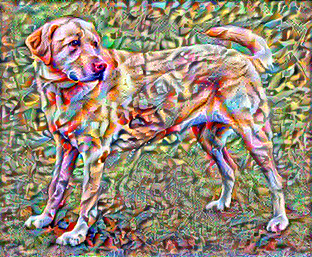

# Neural style transfer with TensorFlow

This is a set of instructions, surrounding and complementary to those at:

https://www.tensorflow.org/tutorials/generative/style_transfer

.

The official docker image contains only the core tools. To run
the Neural Style Transfer example, it is necesssary to build on top
of the official image:

```
# docker pull tensorflow/tensorflow:2.1.1
...
# docker build -t tensorflow-2.1.1-styles .
...
```

Then you have:

```
# docker images
REPOSITORY                TAG                 IMAGE ID            CREATED             SIZE
tensorflow-2.1.1-styles   latest              a1315b187530        18 minutes ago      2.26GB
tensorflow/tensorflow     2.1.1               684ce605b42e        13 days ago         2.04GB
...
```

After this, you can launch an interactive session with:

```
# docker run -u 1000:1000 --rm -it -v /host-dir:/tf-tryout:z -w /tf-tryout tensorflow-2.1.1-styles:latest
```

For most parts, the code just works. I was not interested in image display, so I just skip all the plotting code. I had opened a pull
https://github.com/tensorflow/docs/pull/1592 for a small code improvement.

My outcome after 100 steps:

```
Train step: 100
Total time: 1202.7
```



Theirs first half of 1000 steps:

```
Train step: 1000
Total time: 22.3
```

A whole line of dots comes out for them, every 2 seconds. So obviously, they never noticed the progress bar does not work.

My hardware is about 540x slower (without GPU acceleration). For me, it is 20 minutes. So without my fix, I could be staring
at the screen for 20 minutes wondering what's going on. And I did, twice, interrupting the run, thinking it has gone wrong!

Here is the reference outcome:


```
# docker image rm tensorflow-2.1.1-styles:latest
Untagged: tensorflow-2.1.1-styles:latest
Deleted: sha256:a1315b18753062561d1185e19b4f78be139c3d83b8c9d2ea31617398be4ecb86
Deleted: sha256:a919d216ca6b50a5393187e5f1b96b2d68ffb8327f1b75aa2d1c96225dfad8b4
```

```
# docker image prune
WARNING! This will remove all dangling images.
Are you sure you want to continue? [y/N] y
Total reclaimed space: 0B
```
